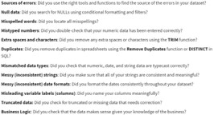

# Data Analysis Process
This is a collection of general notes regarding data analysis that I have collected during the entirety of my study projects.
## Analysis
Data analysis is the collection, transformation, and organization of data in order to draw conclusions, make predictions, and drive informed decision-making.

Key analytical skills: 
- Curiosity
- Understanding Context
- Having a Technical Mindset
- Data Design
- Data Strategy

Key analytical-thinking skills:
- Visualization
- Strategy
- Problem-Orientation
- Correlation
- Big-Picture/ Detail-Oriented Thinking.

Data life cycle: 
- Plan
- Capture
- Manage
- Analyze
- Archive
- Destroy.

As a data analyst, you want to help create systems that are fair and inclusive to everyone. It is important to analyze data for bias and credibility.
- Sampling Bias: When a sample isn't representative of the population as a whole.
- Observer Bias: The tendency for people to observe things differently. 
- Interpretation Bias: The tendency to always interpret ambiguous situations in a positive, or negative way.
- Confirmation Bias: The tendency to search for, or interpret information in a way that confirms preexisting beliefs.

Structured thinking is the process of recognizing the current problem or situation, organizing available information, revealing gaps and opportunities, and identifying the options.

Six common types of problems: 
- Making Predictions
- Categorizing Things
- Spotting Something Unusual
- Identifying Themes
- Discovering Connections
- Finding patterns

### Data 
Methods of collecting data: 
- Interviews
- Observations
- Questionnaires
- Forms
- Surveys
- Cookies

Population: All possible data values in a certain data set.
- Sample: Part of a population that is representative of the population.
  - Don’t use sample sizes less than 30. 
  - Confidence Level: How confident you are in the survey results.
    - The most common accepted confidence level is 95%.
  - Margin-of-error: The amount a sample’s results are expected to differ from what the result would have been if the entire population had been surveyed. The maximum that the sample results are expected to differ from those of the actual population.
  - With a survey result of 60%, a margin of error of 10%, and a confidence level of 95%, there is a 95% chance that the result from the entire population would be in between 50% and 70%.
  - Statistical Significance: The determination of whether your results could be due to random chance or not.
  - Statistical Power: The probability of getting meaningful results from a test.
    - If statistical power is 0.6, or 60%, it means there is a 60% chance of you getting a statistically significant result. A value of 0.8 is generally considered 	 statistically significant.

Qualitative Data: 
- Nominal: Categorized without a set order.
- Ordinal: Categorized with a set order or scale.

Quantitative Data:
- Discrete: Counted and has a limited number of possible values.
- Continuous: Measured and can have almost any numeric value.

Data can be internal or external, structured or unstructured, and wide or long.

Good data sources are Reliable, Original, Comprehensive, Current, and Cited (ROCCC).

#### Data Ethics
Individuals own the raw data they provide, and they have primary control over its usage, how it's processed and how it's shared.

Transaction Transparency: The idea that all data processing activities and algorithms should be completely explainable and understood by the individual who provides their data.

Consent: An individual's right to know explicit details about how and why their data will be used before agreeing to provide it.

Currency: Individuals should be aware of financial transactions resulting from the use of their personal data and the scale of these transactions.

Privacy: Preserving a data subject's information and activity any time a data transaction occurs.	

Openness: Free usage, access, and sharing of data.

Data Anonymization: The process of protecting people's private or sensitive data by eliminating that kind of information.

Personally identifiable information, or PII, is information that can be used by itself or with other data to track down a person's identity.

De-identification: A process used to wipe data clean of all personally identifying information.

#### Metadata
Metadata: Tells you where the data comes from, when and how it was created, and what it's all about.
Several Types:
- Descriptive: Describes a piece of data and can be used to identify it at a later point in time.
- Structural: Indicates how a piece of data is organized and whether it's part of one or more than one data collection.
- Administrative: Indicates the technical source of a digital asset.

Information typically provided: 
- Title and Description
- Tags and Categories
- Who Created it and When
- Who Last Modified it and When
- Who can Access or Update it.

Metadata Repository: A database specifically created to store metadata.

Data Governance: A process to ensure the formal management of a company’s data assets.

### Data Analysis Process
Six Steps: 
- Ask
- Prepare
- Process
- Analyze
- Share
- Act

Effective questions follow the SMART methodology: 
- Specific
- Measurable
- Action-Oriented
- Relevant
- Time-Bound

Data Aggregation: The process of gathering data from multiple sources in order to combine it 	into a single summarized collection.

Data Transformation: The process of changing the data’s format, structure, or values.

Transposing Data: Convert data from long to wide format.

#### Data Cleaning

## Business
A business task is the question or problem data analysis answers for business.

ROI, or Return on Investment is essentially a formula designed using metrics that let a business know how well an investment is doing.
- Made up of two metrics, the net profit over a period of time and the cost of investment.

Growth per Year = Current Year – Previous Year

% Growth per Year = Growth per Year / Previous Year

Profit Margin: A percentage that indicates how many cents of profit have been generated for each dollar of sale.

